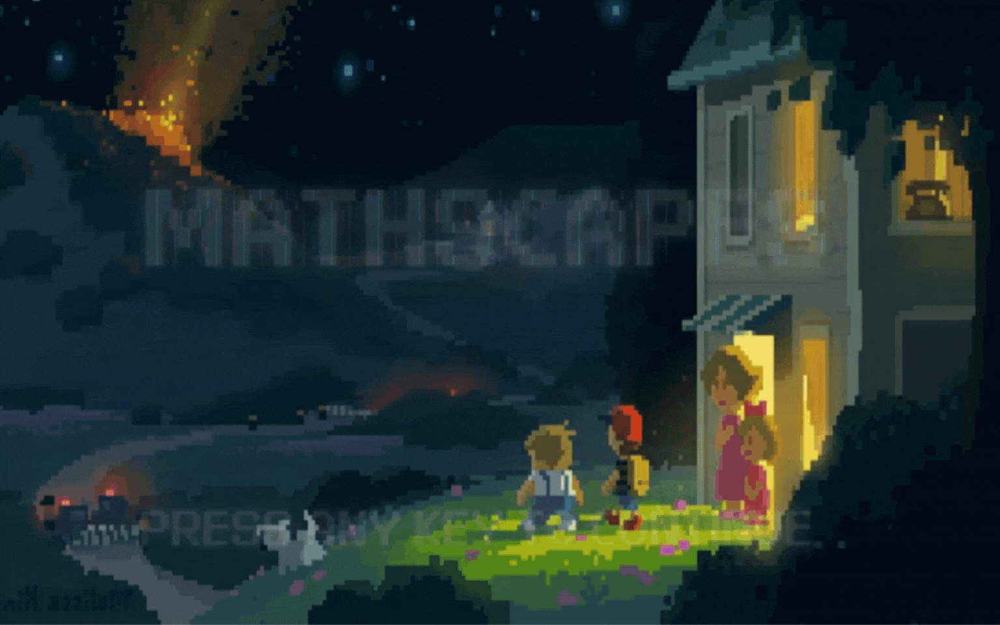
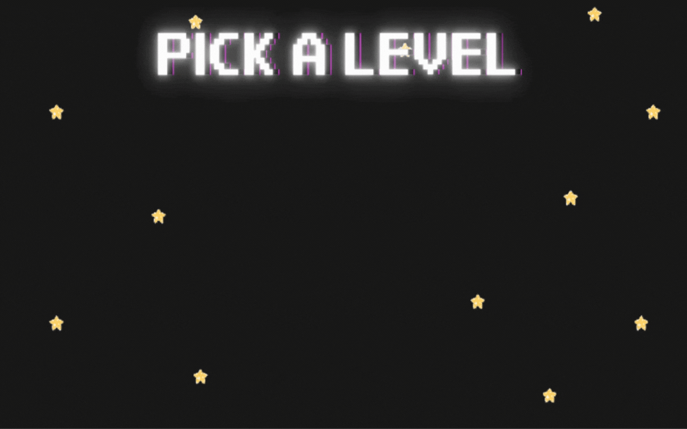
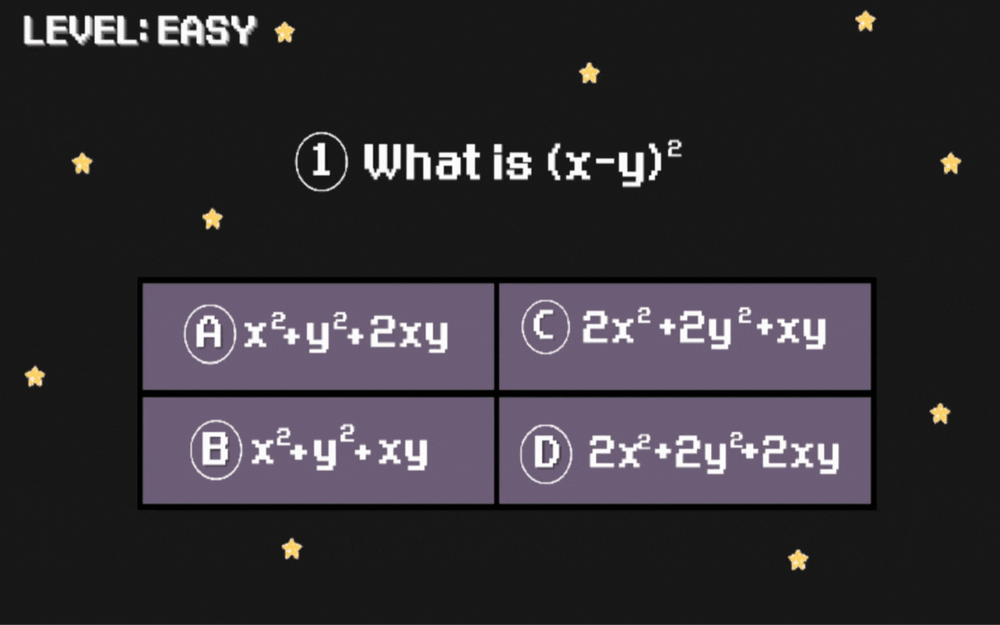
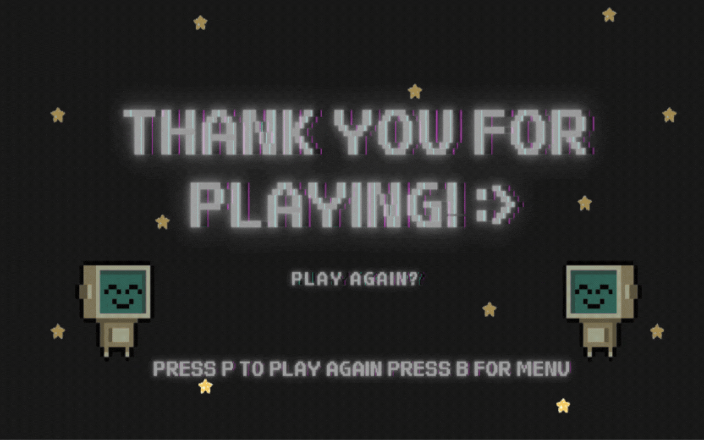
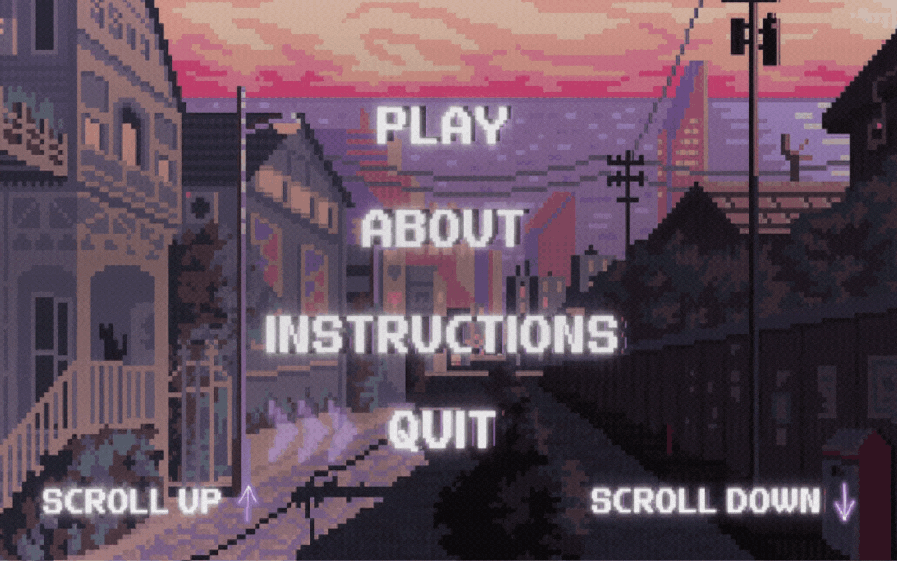

# . ݁₊ ⊹ . ݁˖ . ݁MATHSCAPES . ݁₊ ⊹ . ݁˖ . ݁
[](https://forthebadge.com)
[](https://forthebadge.com)
[](https://forthebadge.com)
[](https://forthebadge.com)

<p align='center'>
	
</p>

Mathscapes is a math-based quiz game inspired by escape rooms. Solve equations to clear levels—Easy, Moderate, or Hard. No calculators allowed, but no time limit either. Designed to make math practice fun and stress-free.

## °❀⋆.ೃ࿔*:･°❀⋆.ೃ࿔*:･ *How to Download* °❀⋆.ೃ࿔*:･°❀⋆.ೃ࿔*:･
Download this project from here [Download Mathscapes](https://downgit.github.io/#/home?url=https://github.com/Kyiewi/MATHSCAPES_PYTHON_QUIZ_GAME/tree/main/MATHSCAPES)

## ༘˚⋆𐙚｡⋆𖦹.✧˚ *Requirements* ༘˚⋆𐙚｡⋆𖦹.✧˚

Use the package manager [pip](https://pip.pypa.io/en/stable/) to install following packages  ˚ ༘ ೀ⋆｡˚
* Pygame

```bash
pip install pygame
```

# ꒷꒦︶꒷꒦︶ ๋ ࣭ ⭑꒷꒦ Usage ꒷꒦︶꒷꒦︶ ๋ ࣭ ⭑꒷꒦

✮⋆˙ Watch the animated Home screen; press any key to continue

<p align='center'>
	
</p>

.𖥔 ݁ ˖ Navigate the menu with ▲/▼ keys and press ENTER to select

<p align='center'>
	
</p>

⋆౨ৎ˚⟡˖ ࣪Choose a quiz mode: Easy, Moderate, or Hard

<p align='center'>
	
</p>

⋆. 𐙚 ̊Questions appear with four options: (A), (B), (C), (D)

⋆. 𐙚 ̊Press the corresponding letter (A–D) on your keyboard to select your answer

⋆. 𐙚 ̊Receive visual feedback (correct/wrong image) and sound

<p align='center'>
	
</p>

࣪ ִֶָ☾.₊⊹ Upon quiz completion, watch the WON animation

<p align='center'>
	
</p>

༉‧₊˚.In the end screen:

𐙚⋆°｡⋆♡Press P to replay the same level

𐙚⋆°｡⋆♡Press B to go back to the main menu

<p align='center'>
	
</p>

˗ˏˋ ★ ˎˊ˗Choose QUIT from the menu, then confirm with Y (yes) or N (no)

<p align='center'>
	
</p>
